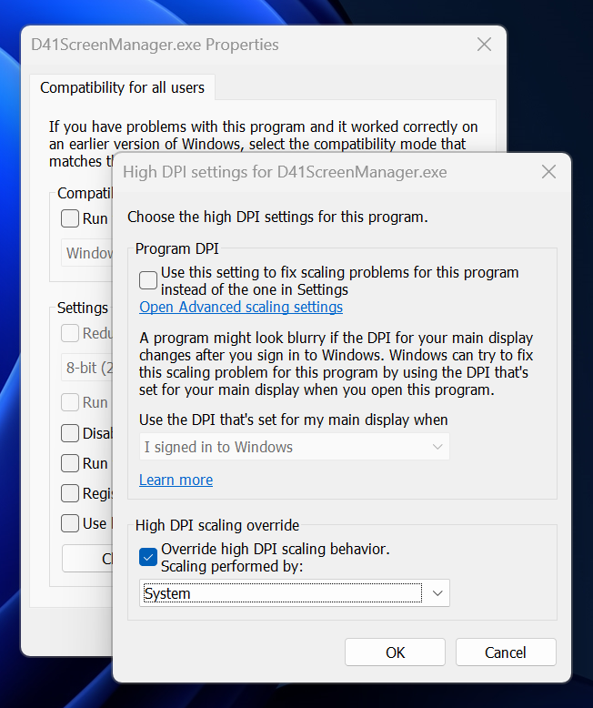
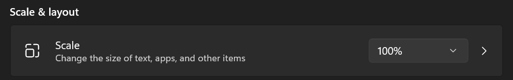
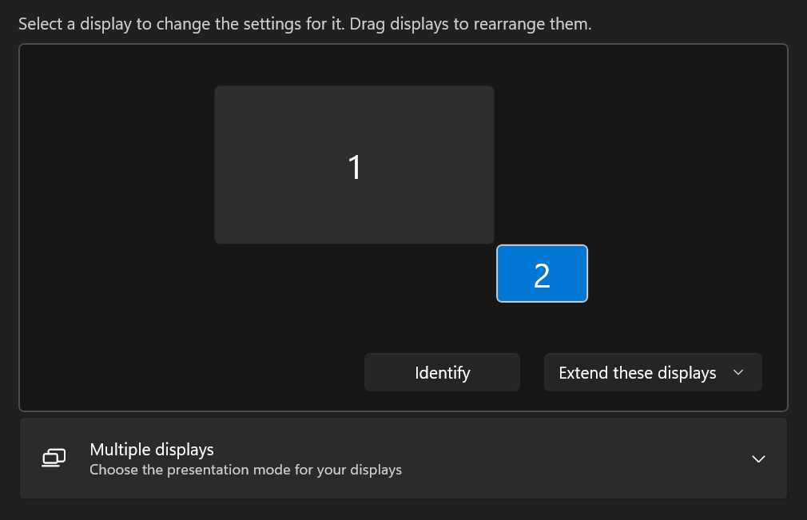

<h1 align="center">Jonsbo D41 Screen Manager</h1>

<!--

Jonsbo D41 Screen Manager
=========================
-->

For Jonsbo D41 computer chassis with integrated HUD screen.

This tool moves windows away from D41 screen if they end up there. This can happen when you turn your main monitor off.

Based on [AutoHotKey](https://www.autohotkey.com/). Use the pre-built `exe` or make your own with [Ahk2Exe](/AutoHotkey/Ahk2Exe).

***

适用于带集成HUD屏幕的Jonsbo D41电脑机箱。

如果窗口出现在 D41 屏幕上，此工具会将它们移开。这种情况可能发生在您关闭主显示器时。

基于 [AutoHotKey](https://www.autohotkey.com/)。可以使用预编译的 `exe` 文件，也可以使用 [Ahk2Exe](/AutoHotkey/Ahk2Exe) 自行编译。

High DPI
--------

**Note:** this script may not work reliably with high DPI screen(s) due to bug with sensor panel scaling in AIDA64. Works best with full HD and quad HD monitors at 100% scaling. **注意：**由于AIDA64的传感器面板缩放存在一个bug，此脚本在高DPI屏幕上可能无法正常运行。它在全高清和四倍高清显示器上以100%缩放比例运行时效果最佳。

You can try make it work by setting "Override high DPI scaling behavior" for all users to "System" in exe "Compatibility" tab settings for both "aida64.exe" and "D41ScreenManager.exe" when high DPI screen is used. 您可以尝试在“兼容性”选项卡设置中，将“aida64.exe”和“D41ScreenManager.exe”的“覆盖高 DPI 缩放行为”设置为“系统”，以此来解决使用高 DPI 屏幕的问题。

Also make sure to set D41 screen scaling to 100% instead of 125% in Windows display settings. 另外，请确保在 Windows 显示设置中将 D41 屏幕缩放比例设置为 100% 而不是 125%。

Pro Tip
-------

How to prevent your mouse cursor from accidentally falling into D41 screen area? It’s simple. Just arrange your monitors in Windows settings like so:

如何防止鼠标光标意外落入D41屏幕区域？很简单。只需在Windows设置中调整显示器位置，如下所示：

